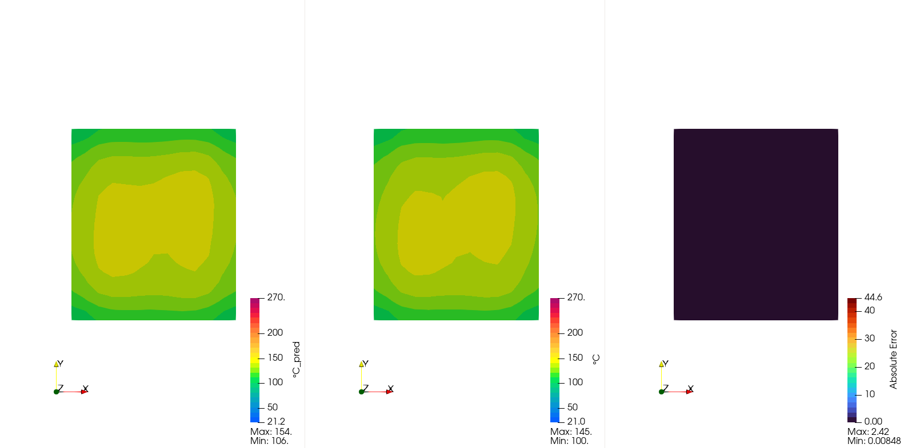
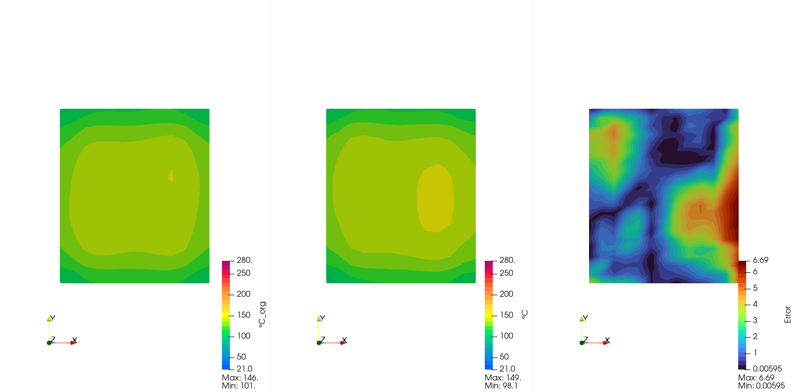

# Surrogate Model results

  

  

    <button onclick="togglePlaySurrogateResults()">▶️ Play / ⏸ Pause</button>
    <button onclick="resetSurrogateResults()">🔄 Reset</button>
  

# Iverse Model results

  

  

    <button onclick="togglePlayInverseResults()">▶️ Play / ⏸ Pause</button>
    <button onclick="resetInverseResults()">🔄 Reset</button>
  

# Real case optimization results
