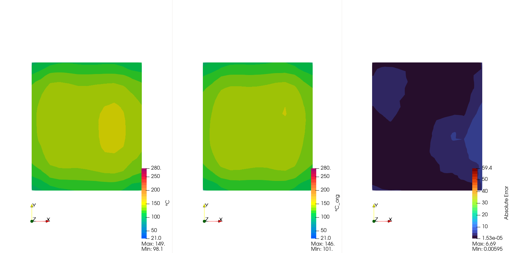

## Surrogate Model results

The first image represents the prediction obtained by the Surrogate Model, the second one the ground-truth and the last one the Absolute Error obtained.

  

  

    <button onclick="togglePlaySurrogateResults()">▶️ Play / ⏸ Pause</button>
    <button onclick="resetSurrogateResults()">🔄 Reset</button>
  

## Inverse Model results

The first image represents the prediction obtained by the Surrogate Model, the second one the prediction of the Inverse Model and the last one the Absolute Error obtained.

  

  

    <button onclick="togglePlayInverseResults()">▶️ Play / ⏸ Pause</button>
    <button onclick="resetInverseResults()">🔄 Reset</button>
  

## Real case optimization results

This video shows the iteration results performed by the optimizer for a real-use case tested.

  <video width="640" height="360" controls>
    <source src="video/ottimizzatore.mp4" type="video/mp4">
    Your browser does not support the video tag.
  </video>

